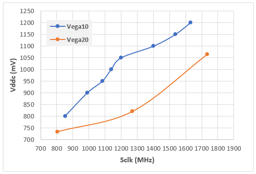
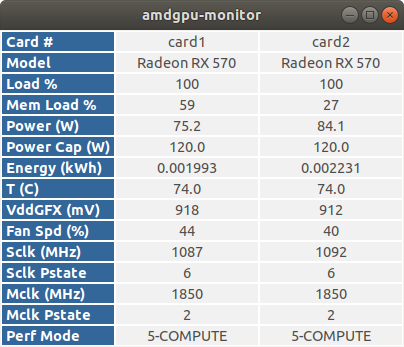
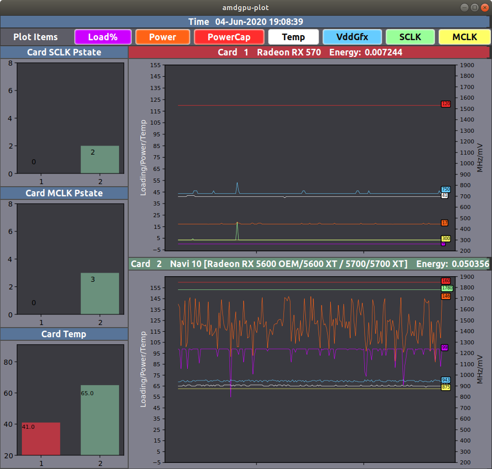
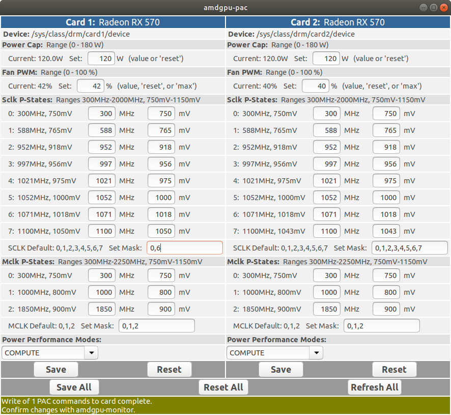
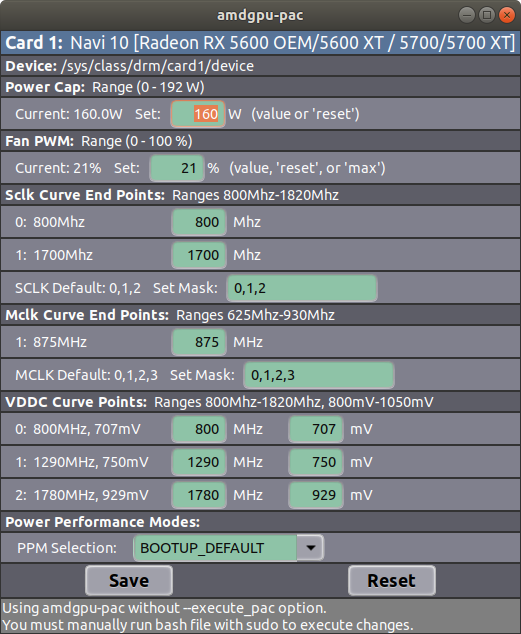

# amdgpu-utils - User Guide
A set of utilities for monitoring AMD GPU performance and modifying control settings.

## Current amdgpu-utils Version: 2.5.x
 - [Getting Started](#getting-started)
 - [Using amdgpu-ls](#using-amdgpu-ls)
 - [GPU Type Dependent Behavior](#gpu-type-dependent-behavior)
 - [Using amdgpu-monitor](#using-amdgpu-monitor)
 - [Using amdgpu-plot](#using-amdgpu-plot)
 - [Using amdgpu-pac](#using-amdgpu-pac)
 - [Using amdgpu-pciid](#using-amdgpu-pciid)
 - [Optimizing Compute Performance-Power](#optimizing-compute-performance-power)

## Getting Started
First, this set of utils is written and tested with Python3.6.  If you are using and older
version, you will likely see syntax errors.  Unfortunately, I don't know how to catch a
syntax error, so if you have issues, just execute:
```
./amdgpu-chk
```
and it should display a message indicating any Python or Kernel incompatibilities.  You will
also notice that there is a minimum version of the Kernel that supports these features, but be
warned, I have only tested it with 4.15. There have been amdgpu features implemented over time
that spans many releases of the kernel, so your experience in using these utilities with older 
kernels may not be ideal.

In order to use any of these utilities, you must have the *amdgpu* open source driver
package installed. You can check with the following command:
```
dpkg -l amdgpu-core amdgpu amdgpu-pro
```

You also must set your linux machine to boot with the feature mask set to support the functionality
that these tools depend on.  Do do this, you must set amdgpu.ppfeaturemask=0xffff7fff.  This
can be accomplished by adding amdgpu.ppfeaturemask=0xffff7fff to the GRUB_CMDLINE_LINUX_DEFAULT
value in /etc/default/grub and executing *sudo update-grub* as in the following example:
```
cd /etc/default
sudo vi grub
```
Modify to include the featuremask as follows:
```
GRUB_CMDLINE_LINUX_DEFAULT="quiet splash amdgpu.ppfeaturemask=0xffff7fff"
```
After saving, update grub:
```
sudo update-grub
```
and then reboot.

If you plan to use the GPU plot feature of amdgpu-monitor, you must first install the pandas and matplotlib modules.  For Ubuntu, use the following for the instalation:

```
sudo apt install python3-pip
pip3 install pandas
sudo apt-get install python3-matplotlib
```


## Using amdgpu-ls
After getting your system setup to support amdgpu-utils, it is best to verify functionality by 
listing your GPU details with the *amdgpu-ls* command.  It first attempts to detect the version 
of amdgpu drivers you have installed and then check compatibility of installed AMD GPUs.  Its
default behavior is to list basic GPU details for all compatible cards:
```AMD Wattman features enabled: 0xffff7fff
amdgpu version: 18.50-725072
2 AMD GPUs detected, 2 may be compatible, checking...
2 are confirmed compatible.

UUID: 309abc9c97ea451396334b11199d0680
amdgpu-utils Compatibility: Yes
Device ID: {'vendor': '0x1002', 'device': '0x687f', 'subsystem_vendor': '0x1002', 'subsystem_device': '0x0b36'}
GPU Frequency/Voltage Control Type: 1
Decoded Device ID: RX Vega64
Card Model:  Vega 10 XT [Radeon RX Vega 64] (rev c1)
Short Card Model:  RX Vega 64
Display Card Model: RX Vega64
Card Number: 1
Card Path: /sys/class/drm/card1/device/
PCIe ID: 44:00.0
Driver: amdgpu
vBIOS Version: 113-D0500100-105
HWmon: /sys/class/drm/card1/device/hwmon/hwmon6/
Current Power (W): 118.0
Power Cap (W): 140.0
Power Cap Range (W): [0, 220]
Fan Enable: 1
Fan PWM Mode: [1, 'Manual']
Current Fan PWM (%): 0
Current Fan Speed (rpm): 0
Fan Target Speed (rpm): 0
Fan Speed Range (rpm): [400, 4900]
Fan PWM Range (%): [0, 100]
Current Temp (C): 35.0
Critical Temp (C): 91.0
Current VddGFX (mV): 1037
Vddc Range: ['800mV', '1200mV']
Current Loading (%): 99
Link Speed: 8 GT/s
Link Width: 16
Current SCLK P-State: 6
Current SCLK: 1536Mhz 
SCLK Range: ['852MHz', '2400MHz']
Current MCLK P-State: 3
Current MCLK: 945Mhz 
MCLK Range: ['167MHz', '1500MHz']
Power Performance Mode: 4-COMPUTE
Power Force Performance Level: manual
```

If everything is working fine, you should see no warning or errors.  The listing utility
also has other command line options:
```usage: amdgpu-ls [-h] [--about] [--pstates] [--ppm] [--clinfo] [--no_fan] [-d]

optional arguments:
  -h, --help   show this help message and exit
  --about      README
  --pstates    Output pstate tables instead of GPU details
  --ppm        Output power/performance mode tables instead of GPU details
  --clinfo     Include openCL with card details
  --no_fan     don't include fan setting options
  -d, --debug  Debug output
```

The *--clinfo* option will make a call to clinfo, if it is installed, and list these parameters
along with the basic parameters.  The benefit of running this in *amdgpu-ls* is that the tool
uses the PCIe slot id to associate clinfo results with the appropriate GPU in the listing.

The *--pstates* and *--ppm* options will display the P-State definition table and the power
performance mode table.
```
./amdgpu-ls --pstate --ppm
AMD Wattman features enabled: 0xffff7fff
amdgpu version: 18.50-725072
2 AMD GPUs detected, 2 may be compatible, checking...
2 are confirmed compatible.

Card: /sys/class/drm/card1/device/
SCLK:                   MCLK:
0:  852Mhz    800mV     0:  167Mhz    800mV   
1:  991Mhz    900mV     1:  500Mhz    800mV   
2:  1084Mhz   950mV     2:  800Mhz    950mV   
3:  1138Mhz   1000mV    3:  945Mhz    1100mV  
4:  1200Mhz   1050mV  
5:  1401Mhz   1100mV  
6:  1536Mhz   1150mV  
7:  1630Mhz   1200mV  

Card: /sys/class/drm/card1/device/
Power Performance Mode: manual
  0:  3D_FULL_SCREEN                70                60                 1                 3
  1:    POWER_SAVING                90                60                 0                 0
  2:           VIDEO                70                60                 0                 0
  3:              VR                70                90                 0                 0
  4:         COMPUTE                30                60                 0                 6
  5:          CUSTOM                 0                 0                 0                 0
 -1:            AUTO              Auto
```

## GPU Type Dependent Behavior
AMD GPU's compatible with the amdgpu open source drivers are of 3 different types in terms of how frequency/voltage
is managed.  GPUs of Vega10 and earlier architecture rely on the definition of specific power states to determine
the clock frequency and voltage.  The GPU will operate at only the specific Frequency/Voltage states that are defined, 
and move between states based on power, temperature, and loading.  These GPU's are of type 1, if the p-state table
is readble and type 0 if it is not. For GPUs of Vega20 architecture or newer, it appears that Voltage/Frequency curves
are defined with 3 points on a Voltage vs. Frequency curve.  These GPU's are classified as type 2.

With the *amdgpu-ls* tool, you can determine if your card is of type 1 or 2. Here are the relevant lines from the 
output for and RX Vega64 GPU and the Radeon VII:
```
Decoded Device ID: R9 290X DirectCU II
GPU Frequency/Voltage Control Type: 0

Decoded Device ID: RX Vega64
GPU Frequency/Voltage Control Type: 1

Decoded Device ID: Radeon VII
GPU Frequency/Voltage Control Type: 2
```

Monitor and Control utilities will differ between the 3 types.
* For type 0, you can monitor the p-state details with monitor utilities, but you can NOT define p-states or set p-state masks.
* For type 1, you can monitor the p-state details with monitor utilities, and you can define p-states and set p-state masks.
* For Type 2, you can monitor current Clocks frequency and p-states, with latest amdgpu drivers.  The SCLK and MCLK curve end points can be controlled, which has the equivalent effect as p-state masking for Type 1 cards.  You are also able to modify the three points that define the Vddc-SCLK curve. I have not attempted to OC the card yet, but I assume redefining the 3rd pointwould be the best approach.  For underclocking, lowering the SCLK end point is effective.  I don't see a curve defined for memory clock on the Radeon VII, so setting memory clock vs. voltage doesn't seem possible at this time.  There also appears to be an inconsistency in the defined voltage ranges for curve points and actual default settings. 

Below is a plot of what I extracted for the Frequency vs Voltage curves of the RX Vega64 and the Radeon VII.



## Using amdgpu-monitor
By default, *amdgpu-monitor* will display a text based table in the current terminal window that updates
every sleep duration, in seconds, as defined by *--sleep N* or 2 seconds by default. If you are using
water cooling, you can us the *--no_fans* to remove fan functionality.
```
┌─────────────┬────────────────┬────────────────┐
│Card #       │card1           │card0           │
├─────────────┼────────────────┼────────────────┤
│Model        │RX Vega64       │Vega 20  Radeon │
│Load %       │99              │93              │
│Power (W)    │60.0            │138.0           │
│Power Cap (W)│140.0           │140.0           │
│Energy (kWh) │1e-06           │3e-06           │
│T (C)        │30.0            │47.0            │
│VddGFX (mV)  │1037            │1062            │
│Fan Spd (%)  │0               │93              │
│Sclk (MHz)   │1536Mhz         │                │
│Sclk Pstate  │6               │-1              │
│Mclk (MHz)   │945Mhz          │                │
│Mclk Pstate  │3               │-1              │
│Perf Mode    │4-COMPUTE       │4-COMPUTE       │
└─────────────┴────────────────┴────────────────┘
```
The fields are the same as the gui version of the display, available with the *--gui* option.


The first row gives the card number for each GPU.  This number is the integer used by the driver for each GPU.  Most fields are self describing.  The Power Cap field is especially useful in managing compute power efficiency, and lowering the cap can result in more level loading and overall lower power usage for little compromise in performance.  The Energy field is a derived metric that accumulates GPU energy usage, in kWh, consumed since the monitor started. Note that total card power usage may be more than reported GPU usage.  Energy is calculated as the product of the latest power reading and the elapsed time since the last power reading. 

You will notice that there are no clock frequencies or valid p-states for the Vega 20 card.  This was due to a limitation in the first drivers that supported Vega 20 which has a change in the way frequency vs voltage is managed. In later version of the drivers, actual clock frequency and p-states are readable. The P-state table for Vega 20 is a definition of frequency vs. voltage curves, so setting p-states to control the GPU is no longer relevant, but these concepts are used in reading current states.

The Perf Mode field gives the current power performance mode, which can be modified in with amdgpu-pac.  These modes affect the how frequency and voltage are managed versus loading.  Ths is a very important parameter when managing compute performance.

Executing *amdgpu-monitor* with the *--plot* option will display a continuously updating plot of the critical GPU parameters.


Having an *amdgpu-monitor* Gtx window open at startup might be useful if you run GPU compute projects that autostart and you need to quickly confirm that *amdgpu-pac* bash scripts ran as expected at startup (see *Using amdgpu-pac*). You can have *amdgpu-monitor --gui* automatically launch at startup or upon reboot by using the startup utility for your system. In Ubuntu, for example, open *Startup Applications*, then in the Preferences window select *Add* and use something like this in the command field:
```
/usr/bin/python3 /home/<user>/Desktop/amdgpu-utils/amdgpu-monitor --gui
```
where `/amdgpu-utils` can be a soft link to your current distribution directory. At the moment, this startup approach does not work for the default terminal text execution of *amdgpu-monitor*. 

## Using amdgpu-plot
In addition to being called from *amdgpu-monitor* with the *--plot* option, *amdgpu-plot* can be ran as a standalone utility.  Just execute *amdgpu-plot --sleep N* and the plot will update at the defined interval.  It is not recomended to run both the monitor with an independently executed plot, as it will result in twice as many reads from the driver files.  Once the plots are displayed, individual items on the plot can be toggled by selecting the named button on the plot display.  Currently, the plot module will eventually freeze, so it is not recomended to run for an extended period of time.  If you know of a solution to this problem, let me know.

The *--stdin* option is used by *amdgpu-monitor --plot* in its execution of *amdgpu-plot*.  This option along with *--simlog* option can be used to simulate a plot output using a log file generated by *amdgpu-monitor --log*.  I use this feature when troubleshooting problems from other users, but may also be useful in benchmarking performance.  An example of the command line for this is as follows:
```
cat log_monitor_0421_081038.txt | ./amdgpu-plot --stdin --simlog
```

## Using amdgpu-pac
By default, *amdgpu-pac* will open a Gtk based GUI to allow the user to modify GPU performance parameters.  I strongly suggest that you completely understand the implications of changing any of the performance settings before you use this utility.  As per the terms of the GNU General Public License that covers this project, there is no warranty on the usability of these tools.  Any use of this tool is at your own risk.

To help you manage the risk in using this tool, there are 2 modes in which GPUs are written to.  By default, a bash file is created that you can review and execute to implement the desired changes.  Here is an example of that file:
```
#!/bin/sh
###########################################################################
## amdgpu-pac generated script to modify GPU configuration/settings
###########################################################################

###########################################################################
## WARNING - Do not execute this script without completely
## understanding appropriate value to write to your specific GPUs
###########################################################################
#
#    Copyright (C) 2019  RueiKe
#
#    This program is free software: you can redistribute it and/or modify
#    it under the terms of the GNU General Public License as published by
#    the Free Software Foundation, either version 3 of the License, or
#    (at your option) any later version.
#
#    This program is distributed in the hope that it will be useful,
#    but WITHOUT ANY WARRANTY; without even the implied warranty of
#    MERCHANTABILITY or FITNESS FOR A PARTICULAR PURPOSE.  See the
#    GNU General Public License for more details.
#
#    You should have received a copy of the GNU General Public License
#    along with this program.  If not, see <https://www.gnu.org/licenses/>.
###########################################################################
# 
# Card1   Vega 10 XT [Radeon RX Vega 64] (rev c1)
# /sys/class/drm/card1/device/
# 
set -x
# Powercap Old:  140 New:  140 Min: 0 Max: 220
sudo sh -c "echo '140000000' >  /sys/class/drm/card1/device/hwmon/hwmon6/power1_cap"
#sck p-state: 0 : 852 MHz, 800 mV
sudo sh -c "echo 's 0 852 800' >  /sys/class/drm/card1/device/pp_od_clk_voltage"
#sck p-state: 1 : 991 MHz, 900 mV
sudo sh -c "echo 's 1 991 900' >  /sys/class/drm/card1/device/pp_od_clk_voltage"
#sck p-state: 2 : 1084 MHz, 950 mV
sudo sh -c "echo 's 2 1084 950' >  /sys/class/drm/card1/device/pp_od_clk_voltage"
#sck p-state: 3 : 1138 MHz, 1000 mV
sudo sh -c "echo 's 3 1138 1000' >  /sys/class/drm/card1/device/pp_od_clk_voltage"
#sck p-state: 4 : 1200 MHz, 1050 mV
sudo sh -c "echo 's 4 1200 1050' >  /sys/class/drm/card1/device/pp_od_clk_voltage"
#sck p-state: 5 : 1401 MHz, 1100 mV
sudo sh -c "echo 's 5 1401 1100' >  /sys/class/drm/card1/device/pp_od_clk_voltage"
#sck p-state: 6 : 1530 MHz, 1150 mV
sudo sh -c "echo 's 6 1530 1150' >  /sys/class/drm/card1/device/pp_od_clk_voltage"
#sck p-state: 7 : 1630 MHz, 1200 mV
sudo sh -c "echo 's 7 1630 1200' >  /sys/class/drm/card1/device/pp_od_clk_voltage"
#mck p-state: 0 : 167 MHz, 800 mV
sudo sh -c "echo 'm 0 167 800' >  /sys/class/drm/card1/device/pp_od_clk_voltage"
#mck p-state: 1 : 500 MHz, 800 mV
sudo sh -c "echo 'm 1 500 800' >  /sys/class/drm/card1/device/pp_od_clk_voltage"
#mck p-state: 2 : 800 MHz, 950 mV
sudo sh -c "echo 'm 2 800 950' >  /sys/class/drm/card1/device/pp_od_clk_voltage"
#mck p-state: 3 : 945 MHz, 1100 mV
sudo sh -c "echo 'm 3 945 1100' >  /sys/class/drm/card1/device/pp_od_clk_voltage"
# Selected: ID=4, name=COMPUTE
sudo sh -c "echo 'manual' >  /sys/class/drm/card1/device/power_dpm_force_performance_level"
sudo sh -c "echo '4' >  /sys/class/drm/card1/device/pp_power_profile_mode"
sudo sh -c "echo 'c' >  /sys/class/drm/card1/device/pp_od_clk_voltage"
# Sclk P-State Mask Default:  0 1 2 3 4 5 6 7 New:  4 5 6
sudo sh -c "echo '4 5 6' >  /sys/class/drm/card1/device/pp_dpm_sclk"
# Mclk P-State Mask Default:  0 1 2 3 New:  3
sudo sh -c "echo '3' >  /sys/class/drm/card1/device/pp_dpm_mclk"
```

When you execute *amdgpu-pac*, you will notice a message bar at the bottom of the interface.  By default, it informs you of the mode you are running in.  By default, the operation mode is to create a bash file, but with the *--execute_pac* (or *--execute*) command line option, the bash file will be automatically executed and then deleted.  The message bar will indicate this status.  Since the driver files are only writable by root, the commands to write configuration settings are executed with sudo.  The message bar will have a red indicator that credentials are pending if that is the case.  Once executed, a yellow message will remind you to check the state of the gpu with *amdgpu-monitor*.  I suggest to use the monitor routine while you run pac in order to see the changes in real-time.

The command line option *--force_write* will result in all configuration parameters to be written to the bash file.  The default behavior since v2.4.0 is to only write changes.  The *--force_write* is useful for creating a bash file which can be execute to set your cards to a known state. As an example, you could use such a file to configure your GPUs on boot up (see below).

### The amdgpu-pac interface for Type 1 cards


### The amdgpu-pac interface for Type 2 cards


In the interface, you will notice entry fields for indicating new values for specific parameters.  In most cases, the values in these fields will be the current values, but in the case of P-state masks, it will show the default value instead of the current value.  If you know how to obtain the current value, please let me know!

Note that when a PAC bash file is executed either manually or automatically, the resulting fan PWM (% speed) may be slightly different from what you see in the Fan PWM entry field.  Such changes to fan PWM may occur even though you did not specifically change Fan PWM and even if Fan PWM was previously set to dynamic (automatic, default) mode.  The direction and magnitude of differences between expected and realized fan speeds may depend on card model, so you will need to experiment with different settings to determine how it works with your card.  I recommend running these experimental settings when the GPU is not under load.  The cause of the differences between entered, or shown, and final fan PWM values is being investigated. 

Changes made with *amdgpu-pac* do not persist through a system reboot. To reestablish desired GPU settings after a reboot, either re-enter them using *amdgpu-pac* or *amdgpu-pac --execute*, or execute a previously saved bash file. *Amdgpu-pac* bash files must retain their originally assigned file name to run properly.

One approach to automatically execute a saved PAC bash file at startup or reboot is to run it as a cron job. To do this, first create a PAC bash file of your optimized GPU settings using the *amdgpu-pac --force-write* command line option. The executable file will be named, *pac_writer_[string-of-characters].sh* and will be created in the current amdgpu-utils directory. If you have additional cards, a separate file will be written for each. Copy the file(s), without renaming and while preserving all attributes, to a convenient directory. (If you leave them in the amdgpu-utils directory, then they my be lost with the next distribution update.) In this example, they have been copied into `/etc/cron.custom`. Now open crontab, the tables that drive cron, using the command `~$ sudo crontab -e`. This will open crontab in your default terminal text editor. (You may be prompted to choose an editor like *nano* or *vi*.) Add a line like this to the file:
```
@reboot /etc/cron.custom/pac_writer_[string of characters].sh && /path/to/additional/pac-bash.sh
```
then save and exit. The next time you reboot, or the system restarts after a power outage, your GPU card(s) will be ready with their optimized settings.  Because some PAC parameters can't be changed when a card is under load, you will want to make sure that PAC settings are executed before the card begins computing. For example, if you have *boinc-client*, then consider delaying it at startup for 30 seconds with the cc_config.xml option *<start_delay>30</start_delay>*.

For Type 1 cards, while changes to power caps and fan speeds can be made while the GPU is under load, other changes may require that the GPU not be under load (be in 0 sclk and mclk P-state) for *amdgpu-pac* to work properly. Possible issues with making changes under load is that the GPU become stuck in a 0 P-state or that the entire system becomes slow to respond, where a reboot is needed to restore settings. Note that when you change a P-pstate mask, default mask values will reappear in the field after Save, but will have been implemented on the card and show up in *amdgpu-monitor*. Some changes may not be permanent when a card has a display connected. 

There is some very basic error checking done before writing, but I suggest you be very certain of all entries before you save to the GPU.

## Using amdgpu-pciid
In determining the GPU display name, *amdgpu-utils* will examine 2 sources.  The output of *lscpi -k -s nn:nn.n* is used to generate a complete name and an algorithm is used to generate a shortened version.  From the driver files, a set of files (vendor, device, subsystem_vendor, subsystem_device) contain a 4 parts of the Device ID are read and used to extract a GPU model name from a file retrieved from  [https://pci-ids.ucw.cz/]( https://pci-ids.ucw.cz/) where a comprehensive list is maintained.  An AMD only extract from that source is included in this distribution.  The *amdgpu-pciid* tool can be used to manage the local extract.  Execute *amdgpu-pciid* to check if a newer version is available and use *amdgpu-pciid --install* to replace the existing extract used by the utilities with an updated version.  If your GPU is not listed in the extract, the pci.id website has an interface to allow the user to request an addition to the master list.  
```
usage: amdgpu-pciid [-h] [--about] [--download] [--install] [--force] [-d]

optional arguments:
  -h, --help   show this help message and exit
  --about      README
  --download   download pci decode table from https://pci-
               ids.ucw.cz/v2.2/pci.ids
  --install    download, parse amd entries, and install a new decode file
  --force      force install of new pci.ids data even if revision is unchanged
  -d, --debug  Debug output
```

## Optimizing Compute Performance-Power
The *amdgpu-utils* tools can be used to optimize performance vs. power for compute workloads by leveraging
its ability to measure power and control relevant GPU settings.  This flexibility allows one to execute a
DOE to measure the effect of GPU settings on the performance in executing specific workloads.  In the case 
of SETI@Home performance, the Energy feature has also been built into [benchMT](https://github.com/Ricks-Lab/benchMT) to benchmark power and execution times for various work units.  This combined with the log file produced with
*amdgpu-monitor --gui --log* can be useful in the optimization of performance.


