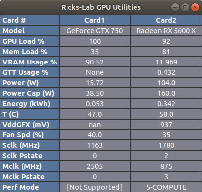
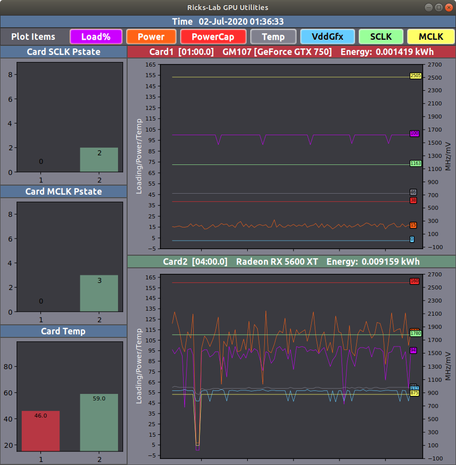

# Ricks-Lab GPU Utilities - User Guide

A set of utilities for monitoring GPU performance and modifying control settings.

## Current rickslab-gpu-utils Version: 3.6.x

 - [Installation](#installation)
 - [Getting Started](#getting-started)
 - [Using gpu-ls](#using-gpu-ls)
 - [GPU Type Dependent Behavior](#gpu-type-dependent-behavior)
 - [Using gpu-mon](#using-gpu-mon)
 - [Using gpu-plot](#using-gpu-plot)
 - [Using gpu-pac](#using-gpu-pac)
 - [Updating the PCI ID decode file](#updating-the-PCI-ID-decode-file)
 - [Optimizing Compute Performance-Power](#optimizing-compute-performance-power)
 - [Running Startup PAC Bash Files](#running-startup-pac-bash-files)


## Installation

There are 4 methods of installation available and summarized here:
* [Repository](#repository-installation) - This approach is recommended for those interested in contributing to the project or helping to troubleshoot an issue in realtime with the developer.
* [PyPI](#pypi-installation) - Meant for users wanting to run the very latest version.  All **PATCH** level versions are released here first.  This install method is also meant for users not on a Debian distribution.
* [Rickslab.com Debian](#rickslabcom-debian-installation) - Lags the PyPI release in order to assure robustness. May not include every **PATCH** version.
* **Official Debian** - Only **MAJOR/MINOR** releases.  This is currently broken by the name change of the project from **ricks-amdgpu-utils** to **rickslab-gpu-utils**. I will update this guide once the Debian package is back in sync with the repository.

### Repository Installation

For a developer/contributor to the project, it is expected that you duplicate the development environment using
a virtual environment. So far, my development activities for this project have used python3.6, but I expect
to move to python3.8 when I upgrade to Ubuntu 20.04. I suggest using the default version of Python for your
distribution, but if it is a later release, limit your code to features of python3.6. The following
are details on setting up a virtual environment with python3.6:

```shell
sudo apt install -y python3.6-venv
sudo apt install -y python3.6.dev
```

Clone the repository from GitHub with the following command:

```shell
git clone https://github.com/Ricks-Lab/gpu-utils.git
cd gpu-utils
```

Initialize your rickslab-gpu-utils-env if it is your first time to use it. From the project root directory, execute:

```shell
python3.6 -m venv rickslab-gpu-utils-env
source rickslab-gpu-utils-env/bin/activate
pip install --no-cache-dir -r requirements-venv.txt
```

You then run the desired commands by specifying the full path: `./gpu-ls`

### PyPI Installation

First, remove any previous Debian package and any ricks-amdgpu-utils PyPI installations:

```shell
sudo apt purge rickslab-gpu-utils
sudo apt purge ricks-amdgpu-utils
sudo apt autoremove
pip3 uninstall ricks-amdgpu-utils
```

Install the latest package from [PyPI](https://pypi.org/project/rickslab-gpu-utils/) with the following
commands:

```shell
pip3 install rickslab-gpu-utils
```

Or, use the pip upgrade option if you have already installed a previous version:

```shell
pip3 install rickslab-gpu-utils -U
```

You may need to open a new terminal window in order for the path to the utilities to be set.

### Rickslab.com Debian Installation

First, remove any previous PyPI installation and exit that terminal.  If you also have a Debian
installed version, the pip uninstall will likely fail, unless you remove the Debian package first:

```shell
pip uninstall rickslab-gpu-utils
exit
```

Also, remove any previous ricks-amdgpu-utils installation:

```shell
sudo apt purge ricks-amdgpu-utils
sudo apt autoremove
```

Next, add the *rickslab-gpu-utils* repository:

```shell
wget -q -O - https://debian.rickslab.com/PUBLIC.KEY | sudo apt-key add -

echo 'deb [arch=amd64] https://debian.rickslab.com/gpu-utils/ eddore main' | sudo tee /etc/apt/sources.list.d/rickslab-gpu-utils.list

sudo apt update
```

Then install the package with apt:

```shell
sudo apt install rickslab-gpu-utils
```

## Getting Started

First, this set of utilities is written and tested with Python3.6.  If you are using an older
version, you will likely see syntax errors.  If you are encountering problems, then execute:

```shell
gpu-chk
```

This should display a message indicating any Python or Kernel incompatibilities. In order to
get maximum capability of these utilities, you should be running with a kernel that provides
support of the GPUs you have installed.  If using AMD GPUs, installing the latest **amdgpu**
driver package or the latest **ROCm** release, may provide additional capabilities. If you
have Nvidia GPUs installed, you should have **nvidia.smi** installed in order for the utility
reading of the cards to be possible.  Writing to GPUs is currently only possible for AMD GPUs,
and only with compatible cards.  Modifying AMD GPU properties requires the AMD ppfeaturemask
to be set to 0xfffd7fff. This can be accomplished by adding `amdgpu.ppfeaturemask=0xfffd7fff`
to the `GRUB_CMDLINE_LINUX_DEFAULT` value in `/etc/default/grub` and executing `sudo update-grub`:

```shell
cd /etc/default
sudo vi grub
```

Modify to include the featuremask as follows:

```shell
GRUB_CMDLINE_LINUX_DEFAULT="quiet splash amdgpu.ppfeaturemask=0xfffd7fff"
```

After saving, update grub:

```shell
sudo update-grub
```

and then reboot.

If you have Nvidia GPUs installed, you will need to have nvidia-smi installed.

## Using gpu-ls

After getting your system setup to support rickslab-gpu-utils, it is best to verify functionality by
listing your GPU details with the *gpu-ls* command.  The utility will use the system `lspci` command
to identify all installed GPUs.  The utility will also verify system setup/configuration for read, write,
and compute capability.  Additional performance/configuration details are read from the GPU for compatible
GPUs.  Example of the output is as follows:

```
OS command [nvidia-smi] executable found: [/usr/bin/nvidia-smi]
Detected GPUs: INTEL: 1, NVIDIA: 1, AMD: 1
AMD: amdgpu version: 20.10-1048554
AMD: Wattman features enabled: 0xfffd7fff
3 total GPUs, 1 rw, 1 r-only, 0 w-only

Card Number: 0
   Vendor: INTEL
   Readable: False
   Writable: False
   Compute: False
   Device ID: {'device': '0x3e91', 'subsystem_device': '0x8694', 'subsystem_vendor': '0x1043', 'vendor': '0x8086'}
   Decoded Device ID: 8th Gen Core Processor Gaussian Mixture Model
   Card Model: Intel Corporation 8th Gen Core Processor Gaussian Mixture Model
   PCIe ID: 00:02.0
   Driver: i915
   GPU Type: Unsupported
   HWmon: None
   Card Path: /sys/class/drm/card0/device
   System Card Path: /sys/devices/pci0000:00/0000:00:02.0

Card Number: 1
   Vendor: NVIDIA
   Readable: True
   Writable: False
   Compute: True
   GPU UID: GPU-fcbaadc4-4040-c2e5-d5b6-52d1547bcc64
   GPU S/N: [Not Supported]
   Device ID: {'device': '0x1381', 'subsystem_device': '0x1073', 'subsystem_vendor': '0x10de', 'vendor': '0x10de'}
   Decoded Device ID: GM107 [GeForce GTX 750]
   Card Model: GeForce GTX 750
   Display Card Model: GeForce GTX 750
   Card Index: 0
   PCIe ID: 01:00.0
      Link Speed: GEN3
      Link Width: 8
   ##################################################
   Driver: 390.138
   vBIOS Version: 82.07.32.00.32
   Compute Platform: OpenCL 1.2 CUDA
   Compute Mode: Default
   GPU Type: Supported
   HWmon: None
   Card Path: /sys/class/drm/card1/device
   System Card Path: /sys/devices/pci0000:00/0000:00:01.0/0000:01:00.0
   ##################################################
   Current Power (W): 15.910
   Power Cap (W): 38.50
      Power Cap Range (W): [30.0, 38.5]
   Fan Target Speed (rpm): None
   Current Fan PWM (%): 40.000
   ##################################################
   Current GPU Loading (%): 100
   Current Memory Loading (%): 36
   Current VRAM Usage (%): 91.437
      Current VRAM Used (GB): 0.876
      Total VRAM (GB): 0.958
   Current  Temps (C): {'temperature.gpu': 40.0, 'temperature.memory': None}
   Current Clk Frequencies (MHz): {'clocks.gr': 1163.0, 'clocks.mem': 2505.0, 'clocks.sm': 1163.0, 'clocks.video': 1046.0}
   Maximum Clk Frequencies (MHz): {'clocks.max.gr': 1293.0, 'clocks.max.mem': 2505.0, 'clocks.max.sm': 1293.0}
   Current SCLK P-State: [0, '']
   Power Profile Mode: [Not Supported]

Card Number: 2
   Vendor: AMD
   Readable: True
   Writable: True
   Compute: True
   GPU UID: None
   Device ID: {'device': '0x731f', 'subsystem_device': '0xe411', 'subsystem_vendor': '0x1da2', 'vendor': '0x1002'}
   Decoded Device ID: Radeon RX 5600 XT
   Card Model: Advanced Micro Devices, Inc. [AMD/ATI] Navi 10 [Radeon RX 5600 OEM/5600 XT / 5700/5700 XT] (rev ca)
   Display Card Model: Radeon RX 5600 XT
   PCIe ID: 04:00.0
      Link Speed: 16 GT/s
      Link Width: 16
   ##################################################
   Driver: amdgpu
   vBIOS Version: 113-5E4111U-X4G
   Compute Platform: OpenCL 2.0 AMD-APP (3075.10)
   GPU Type: CurvePts
   HWmon: /sys/class/drm/card2/device/hwmon/hwmon3
   Card Path: /sys/class/drm/card2/device
   System Card Path: /sys/devices/pci0000:00/0000:00:01.1/0000:02:00.0/0000:03:00.0/0000:04:00.0
   ##################################################
   Current Power (W): 99.000
   Power Cap (W): 160.000
      Power Cap Range (W): [0, 192]
   Fan Enable: 0
   Fan PWM Mode: [2, 'Dynamic']
   Fan Target Speed (rpm): 1170
   Current Fan Speed (rpm): 1170
   Current Fan PWM (%): 35
      Fan Speed Range (rpm): [0, 3200]
      Fan PWM Range (%): [0, 100]
   ##################################################
   Current GPU Loading (%): 50
   Current Memory Loading (%): 49
   Current GTT Memory Usage (%): 0.432
      Current GTT Memory Used (GB): 0.026
      Total GTT Memory (GB): 5.984
   Current VRAM Usage (%): 11.969
      Current VRAM Used (GB): 0.716
      Total VRAM (GB): 5.984
   Current  Temps (C): {'edge': 54.0, 'junction': 61.0, 'mem': 68.0}
   Critical Temps (C): {'edge': 118.0, 'junction': 99.0, 'mem': 99.0}
   Current Voltages (V): {'vddgfx': 937}
   Current Clk Frequencies (MHz): {'mclk': 875.0, 'sclk': 1780.0}
   Current SCLK P-State: [2, '1780Mhz']
      SCLK Range: ['800Mhz', '1820Mhz']
   Current MCLK P-State: [3, '875Mhz']
      MCLK Range: ['625Mhz', '930Mhz']
   Power Profile Mode: 5-COMPUTE
   Power DPM Force Performance Level: manual
```

If everything is working fine, you should see no warning or errors.  The listing utility
also has other command line options:

```
usage: gpu-ls [-h] [--about] [--short] [--table] [--pstates] [--ppm]
              [--clinfo] [--no_fan] [-d]

optional arguments:
  -h, --help   show this help message and exit
  --about      README
  --short      Short listing of basic GPU details
  --table      Current status of readable GPUs
  --pstates    Output pstate tables instead of GPU details
  --ppm        Output power/performance mode tables instead of GPU details
  --clinfo     Include openCL with card details
  --no_fan     Do not include fan setting options
  -d, --debug  Debug logger output
```

The *--clinfo* option will make a call to clinfo, if it is installed, and list openCL parameters
along with the basic parameters.  The benefit of running this in *gpu-ls* is that the tool
uses the PCIe slot id to associate clinfo results with the appropriate GPU in the listing.

The *--pstates* and *--ppm* options will display the P-State definition table and the power
performance mode table.

```
gpu-ls --pstate --ppm
Detected GPUs: AMD: 1, ASPEED: 1
AMD: rocm version: 3.0.6
AMD: Wattman features enabled: 0xfffd7fff
2 total GPUs, 1 rw, 0 r-only, 0 w-only

Card Number: 1
   Card Model: Vega 20
   Card Path: /sys/class/drm/card1/device
   GPU Frequency/Voltage Control Type: CurvePts
   ##################################################
   DPM States:
   SCLK:                   MCLK:
    0:  701Mhz              0:  351Mhz
    1:  809Mhz              1:  801Mhz
    2:  1085Mhz             2:  1051Mhz
    3:  1287Mhz             
    4:  1434Mhz             
    5:  1550Mhz             
    6:  1606Mhz             
    7:  1627Mhz             
    8:  1651Mhz             
   ##################################################
   PP OD States:
   SCLK:                   MCLK:
    0:  808Mhz    -         
    1:  1650Mhz   -         1:  1050Mhz   -       
   ################################################## 
   VDDC_CURVE:
    0: ['808Mhz', '724mV']
    1: ['1304Mhz', '822mV']
    2: ['1801Mhz', '1124mV']

Card Number: 1
   Card Model: Vega 20
   Card: /sys/class/drm/card1/device
   Power Performance Mode: manual
    0:   BOOTUP_DEFAULT
    1:   3D_FULL_SCREEN
    2:     POWER_SAVING
    3:            VIDEO
    4:               VR
    5:          COMPUTE
    6:           CUSTOM
   -1:             AUTO
```

Different generations of cards will provide different information with the --ppm option. Here is an
example for AMD Ellesmere and Polaris cards:

```
gpu-ls --ppm
Detected GPUs: INTEL: 1, AMD: 2
AMD: amdgpu version: 19.50-967956
AMD: Wattman features enabled: 0xfffd7fff
3 total GPUs, 2 rw, 0 r-only, 0 w-only

Card Number: 1
   Card Model: Advanced Micro Devices, Inc. [AMD/ATI] Ellesmere [Radeon RX 470/480/570/570X/580/580X/590] (rev ef)
   Card Path: /sys/class/drm/card1/device
   Power DPM Force Performance Level: manual
   NUM        MODE_NAME     SCLK_UP_HYST   SCLK_DOWN_HYST SCLK_ACTIVE_LEVEL     MCLK_UP_HYST   MCLK_DOWN_HYST MCLK_ACTIVE_LEVEL
     0   BOOTUP_DEFAULT:        -                -                -                -                -                -
     1   3D_FULL_SCREEN:        0              100               30                0              100               10
     2     POWER_SAVING:       10                0               30                -                -                -
     3            VIDEO:        -                -                -               10               16               31
     4               VR:        0               11               50                0              100               10
     5        COMPUTE *:        0                5               30                0              100               10
     6           CUSTOM:        -                -                -                -                -                -
```

## GPU Type Dependent Behavior

GPU capability and compatibility varies over the various vendors and generations of hardware.  In
order to manage this variability, rickslab-gpu-utils must classify each installed GPU by its vendor
and type.  So far, valid types are as follows:

* **Undefined** - This is the default assigned type, before a valid type can be determined.
* **Unsupported** - This is the type assigned for cards which have no capability of reading beyond basic parameters typical of PCIe devices.
* **Supported** - This is the type assigned for basic readability, including *nvidia-smi* readabile GPUs.
* **Legacy** - Applies to legacy AMD GPUs with very basic parameters available to read. (pre-HD7)
* **APU** - Applies to AMD integrated graphics with limited parameters available. (Carizzo - Renoir)
* **PStatesNE** - Applies to AMD GPUs with most parameters available, but Pstates not writeable. (HD7 series)
* **PStates** - Applies to modern AMD GPUs with writeable Pstates. (R9 series thr RX-Vega)
* **CurvePts** - Applies to latest generation AMD GPUs that use AVFS curves instead of Pstates. (Vega20 and newer)

With the *gpu-ls* tool, you can determine the type of your installed GPUs. Here are examples of
relevant lines from the output for different types of GPUs:

```
Decoded Device ID: 8th Gen Core Processor Gaussian Mixture Model 
GPU Type: Unsupported                                              # Intel CPU with integrated graphics

Decoded Device ID: GM107 [GeForce GTX 750]
GPU Type: Supported

Decoded Device ID: R9 290X DirectCU II
GPU Type: PStatesNE

Decoded Device ID: RX Vega64
GPU Type: PStates

Decoded Device ID: Radeon VII
GPU Type: CurvePts

Decoded Device ID: Radeon RX 5600 XT
GPU Type: CurvePts
```

Monitor and Control utilities will differ between these types:

* For **Undefined** and **Unsupported** types, only generic PCIe parameters are available.  These types are
considered unreadable, unwritable, and as having no compute capability.
* For **Supported** types have the most basic level of readability.  This includes NV cards with nvidia-smi support.
* For **Legacy** and **APU**, only basic and limited respectively are readable.
* For **Pstates** and **PstatesNE** type GPUs, pstate details are readable, but for **PstatesNE** they are not
writable. For type **Pstates** pstate Voltages/Frequencies as well as pstate masking can be specified.
* The **CurvePts** type applies to modern (Vega20 and later) AMD GPUs that use AVFS instead of Pstates for
performance control.  These have the highest degree of read/write capability. The SCLK and MCLK curve end points
can be controlled, which has the effect of over/under clocking/voltage.  You are also able to modify the three points that define the Vddc-SCLK curve. I have not attempted to OC the card yet, but I assume redefining the 3rd point would be the best approach.  For underclocking, lowering the SCLK end point is effective.  I don't see a curve defined for memory clock on the Radeon VII, so setting memory clock vs. voltage doesn't seem possible at this time.  There also appears to be an inconsistency in the defined voltage ranges for curve points and actual default settings. 

Below is a plot of what I extracted for the Frequency vs Voltage curves of the RX Vega64 and the Radeon VII.


## Using gpu-mon

By default, *gpu-mon* will display a text based table in the current terminal window that updates
every sleep duration, in seconds, as defined by *--sleep N* or 2 seconds by default. If you are using
water cooling, you can use the *--no_fans* to remove fan monitoring functionality.

```
┌─────────────┬────────────────┬────────────────┐
│Card #       │card1           │card2           │
├─────────────┼────────────────┼────────────────┤
│Model        │GeForce GTX 750 │Radeon RX 5600 X│
│GPU Load %   │100             │91              │
│Mem Load %   │36              │68              │
│VRAM Usage % │89.297          │11.969          │
│GTT Usage %  │None            │0.432           │
│Power (W)    │15.69           │92.0            │
│Power Cap (W)│38.50           │160.0           │
│Energy (kWh) │0.0             │0.002           │
│T (C)        │48.0            │61.0            │
│VddGFX (mV)  │nan             │925             │
│Fan Spd (%)  │40.0            │36              │
│Sclk (MHz)   │1163            │1780            │
│Sclk Pstate  │0               │2               │
│Mclk (MHz)   │2505            │875             │
│Mclk Pstate  │0               │3               │
│Perf Mode    │[Not Supported] │5-COMPUTE       │
└─────────────┴────────────────┴────────────────┘
```

The fields are the same as the GUI version of the display, available with the *--gui* option.



The first row gives the card number for each GPU.  This number is the integer used by the driver for each GPU.  Most
fields are self describing.  The Power Cap field is especially useful in managing compute power efficiency, and
lowering the cap can result in more level loading and overall lower power usage for little compromise in performance. 
The Energy field is a derived metric that accumulates GPU energy usage, in kWh, consumed since the monitor started.
Note that total card power usage may be more than reported GPU power usage.  Energy is calculated as the product of
the latest power reading and the elapsed time since the last power reading. 

The P-states in the table for **CurvePts** type GPU are an indication of frequency vs. voltage curves.
Setting P-states to control the GPU is no longer relevant for this type, but these concepts are used in
reading current states.

The Perf Mode field gives the current power performance mode, which may be modified in with *gpu-pac*.  These
modes affect the how frequency and voltage are managed versus loading.  This is a very important parameter when
managing compute performance.

Executing *gpu-mon* with the *--plot* option will display a continuously updating plot of the critical
GPU parameters.


Having an *gpu-mon* Gtx window open at startup may be useful if you run GPU compute projects that autostart
and you need to quickly confirm that *gpu-pac* bash scripts ran as expected at startup
(see [Using gpu-pac](#using-gpu-pac)). You can have *gpu-mon --gui* automatically launch at startup
or upon reboot by using the startup utility for your distribution. In Ubuntu, for example, open *Startup Applications
Preferences* app, then in the Preferences window select *Add* and use something like this in the command field:

```
/usr/bin/python3 /home/<user>/Desktop/rickslab-gpu-utils/gpu-mon --gui
```

where `/rickslab-gpu-utils` may be a soft link to your current distribution directory. This startup approach does not
work for the default Terminal text execution of *gpu-mon*. 

## Using gpu-plot

In addition to being called from *gpu-mon* with the *--plot* option, *gpu-plot* may be ran as a standalone
utility.  Just execute *gpu-plot --sleep N* and the plot will update at the defined interval.  It is not
recommended to run both the monitor with an independently executed plot, as it will result in twice as many reads
from the driver files.  Once the plots are displayed, individual items on the plot can be toggled by selecting the
named button on the plot display.

The *--stdin* option is used by *gpu-mon --plot* in its execution of *gpu-plot*.  This option along
with *--simlog* option can be used to simulate a plot output using a log file generated by *gpu-mon --log*. 
I use this feature when troubleshooting problems from other users, but it may also be useful in benchmarking
performance.  An example of the command line for this is as follows:

```
cat log_monitor_0421_081038.txt | gpu-plot --stdin --simlog
```

## Using gpu-pac

By default, *gpu-pac* will open a Gtk based GUI to allow the user to modify GPU performance parameters.  I strongly
suggest that you completely understand the implications of changing any of the performance settings before you use
this utility.  As per the terms of the GNU General Public License that covers this project, there is no warranty on
the usability of these tools.  Any use of this tool is at your own risk.

To help you manage the risk in using this tool, two modes are provided to modify GPU parameters.  By default, a bash
file is created that you can review and execute to implement the desired changes.  Here is an example of that file:

```
#!/bin/sh
###########################################################################
## rickslab-gpu-pac generated script to modify GPU configuration/settings
###########################################################################

###########################################################################
## WARNING - Do not execute this script without completely
## understanding appropriate values to write to your specific GPUs
###########################################################################
#
#    Copyright (C) 2019  RueiKe
#
#    This program is free software: you can redistribute it and/or modify
#    it under the terms of the GNU General Public License as published by
#    the Free Software Foundation, either version 3 of the License, or
#    (at your option) any later version.
#
#    This program is distributed in the hope that it will be useful,
#    but WITHOUT ANY WARRANTY; without even the implied warranty of
#    MERCHANTABILITY or FITNESS FOR A PARTICULAR PURPOSE.  See the
#    GNU General Public License for more details.
#
#    You should have received a copy of the GNU General Public License
#    along with this program.  If not, see <https://www.gnu.org/licenses/>.
###########################################################################
# 
# Card1  Advanced Micro Devices, Inc. [AMD/ATI] Vega 20 (rev c1)
# /sys/class/drm/card1/device
# 
set -x
# Power DPM Force Performance Level: [manual] change to [manual]
sudo sh -c "echo 'manual' >  /sys/class/drm/card1/device/power_dpm_force_performance_level"
# Powercap Old: 150 New: 150 Min: 0 Max: 300
sudo sh -c "echo '150000000' >  /sys/class/drm/card1/device/hwmon/hwmon2/power1_cap"
# Fan PWM Old: 0 New: 0 Min: 0 Max: 100
sudo sh -c "echo '1' >  /sys/class/drm/card1/device/hwmon/hwmon2/pwm1_enable"
sudo sh -c "echo '0' >  /sys/class/drm/card1/device/hwmon/hwmon2/pwm1"
# sclk curve end point: 0 : 808 MHz
sudo sh -c "echo 's 0 808' >  /sys/class/drm/card1/device/pp_od_clk_voltage"
# sclk curve end point: 1 : 1650 MHz
sudo sh -c "echo 's 1 1650' >  /sys/class/drm/card1/device/pp_od_clk_voltage"
# mclk curve end point: 1 : 1050 MHz
sudo sh -c "echo 'm 1 1050' >  /sys/class/drm/card1/device/pp_od_clk_voltage"
# vddc curve point: 0 : 808 MHz, 724 mV
sudo sh -c "echo 'vc 0 808 724' >  /sys/class/drm/card1/device/pp_od_clk_voltage"
# vddc curve point: 1 : 1304 MHz, 822 mV
sudo sh -c "echo 'vc 1 1304 822' >  /sys/class/drm/card1/device/pp_od_clk_voltage"
# vddc curve point: 2 : 1801 MHz, 1124 mV
sudo sh -c "echo 'vc 2 1801 1124' >  /sys/class/drm/card1/device/pp_od_clk_voltage"
# Selected: ID=5, name=COMPUTE
sudo sh -c "echo '5' >  /sys/class/drm/card1/device/pp_power_profile_mode"
sudo sh -c "echo 'c' >  /sys/class/drm/card1/device/pp_od_clk_voltage"
# Sclk P-State Mask Default: 0 1 2 3 4 5 6 7 8 New: 0 1 2 3 4 5 6 7 8
sudo sh -c "echo '0 1 2 3 4 5 6 7 8' >  /sys/class/drm/card1/device/pp_dpm_sclk"
# Mclk P-State Mask Default: 0 1 2 New: 0 1 2
sudo sh -c "echo '0 1 2' >  /sys/class/drm/card1/device/pp_dpm_mclk"
```

When you execute *gpu-pac*, you will notice a message bar at the bottom of the interface.  By default, it informs
you of the mode you are running in.  By default, the operation mode is to create a bash file, but with the
*--execute_pac* (or *--execute*) command line option, the bash file will be automatically executed and then deleted. 
The message bar will indicate this status.  Because the driver files are writable only by root, the commands to
write configuration settings are executed with sudo.  The message bar will display in red when credentials are
pending.  Once executed, a yellow message will remind you to check the state of the gpu with *gpu-mon*.  I
suggest using the monitor routine when executing pac to see and confirm the changes in real-time.

The command line option *--force_write* will result in all configuration parameters to be written to the bash file. 
The default behavior since v2.4.0 is to write only changes.  The *--force_write* is useful for creating a bash file
that can be execute to set your cards to a known state. As an example, you could use such a file to configure your
GPUs on boot up (see [Running Startup PAC Bash Files](#running-startup-pac-bash-files)).

### The gpu-pac interface for Type PStates and Type CurvePts cards


In the interface, you will notice entry fields for indicating new values for specific parameters.  In most cases, the
values in these fields will be the current values, but in the case of P-state masks, it will show the default value
instead of the current value.  If you know how to obtain the current value, please let me know!

Note that when a PAC bash file is executed either manually or automatically, the resulting fan PWM (% speed) may
be slightly different from what you see in the Fan PWM entry field.  The direction and magnitude of differences
between expected and realized fan speeds can depend on card model.  You will need to experiment with different
settings to determine how it works with your card.  I recommend running these experimental settings when the GPU
is not under load.  If you know the cause of the differences between entered and final fan PWM values, let me know. 

Changes made with *gpu-pac* do not persist through a system reboot. To reestablish desired GPU settings after a
reboot, either re-enter them using *gpu-pac* or *gpu-pac --execute*, or execute a previously saved bash file.
*gpu-pac* bash files must retain their originally assigned file name to run properly.
See [Running Startup PAC Bash Files](#running-startup-pac-bash-files) for how to run PAC bash
scripts automatically at system startup.

For Type **Pstates** cards, while changes to power caps and fan speeds can be made while the GPU is under load, for
*gpu-pac* to work properly, other changes may require that the GPU not be under load, *i.e.*, that sclk
P-state and mclk P-state are 0. Possible consequences with making changes under load is that the GPU become
stuck in a 0 P-state or that the entire system becomes slow to respond, where a reboot will be needed to restore
full GPU functions. Note that when you change a P-state mask, default mask values will reappear in the field
after Save, but your specified changes will have been implemented on the card and show up in *gpu-mon*.
Some changes may not persist when a card has a connected display. When changing P-state MHz or mV, the desired
P-state mask, if different from default (no masking), will have to be re-entered for clock or voltage changes to
be applied. Again, save PAC changes to clocks, voltages, or masks only when the GPU is at resting state (state 0).

For Type **CurvePts** cards, although changes to P-state masks cannot be made through *gpu-pac*, changes to all
other fields can be made on-the-fly while the card is under load.

Some basic error checking is done before writing, but I suggest you be very certain of all entries before you save
changes to the GPU.  You should always confirm your changes with *gpu-mon*.

## Updating the PCI ID decode file 

In determining the GPU display name, *rickslab-gpu-utils* will examine two sources.  The output of 
`lspci -k -s nn:nn.n` is used to generate a complete name and an algorithm is used to generate a shortened
version.  From the driver files, a set of files (vendor, device, subsystem_vendor, subsystem_device) contain
4 parts of the Device ID are read and used to extract a GPU model name from system pci.ids file which is
sourced from [https://pci-ids.ucw.cz/](https://pci-ids.ucw.cz/) where a comprehensive list is maintained.  The
system file can be updated from the original source with the command:

```
sudo update-pciids
```

If your GPU is not listed in the extract, the pci.id website has an interface to allow the user to request an
addition to the master list.  

## Optimizing Compute Performance-Power

The *rickslab-gpu-utils* tools can be used to optimize performance vs. power for compute workloads by leveraging
its ability to measure power and control relevant GPU settings.  This flexibility allows one to execute a
DOE to measure the effect of GPU settings on the performance in executing specific workloads.  In SETI@Home
performance, the Energy feature has also been built into [benchMT](https://github.com/Ricks-Lab/benchMT) to
benchmark power and execution times for various work units.  This, combined with the log file produced with
*gpu-mon --gui --log*, may be useful in optimizing performance.


## Running Startup PAC Bash Files

If you set your system to run *gpu-pac* bash scripts automatically, as described in this section, note that
changes in your hardware or graphic drivers may cause potentially serious problems with GPU settings unless new
PAC bash files are generated following the changes. Review the [Using gpu-pac](#using-gpu-pac) section
before proceeding.

One approach is to execute PAC bash scripts as a systemd startup service. From *gpu-pac --force_write*, set your optimal configurations for each GPU, then Save All. You may need to change ownership to root of each card's bash file: `sudo chown root pac_writer*.sh`

For each bash file, you could create a symlink (soft link) that corresponds to the card number referenced in each
linked bash file, using simple descriptive names, *e.g.*, pac_writer_card1, pac_writer_card2, *etc.*. These links are
optional, but can make management of new or edited startup bash files easier. Links are used in the startup service
example, below. Don't forget to reform the link(s) each time a new PAC bash file is written for a card. 
 
Next, create a .service file named something like, gpu-pac-startup.service and give it the following content:

```
[Unit]
Description=run at boot rickslab-gpu-utils PAC bash scripts

[Service]
Type=oneshot

ExecStart=/home/<user>/pac_writer_card0
ExecStart=/home/<user>/pac_writer_card1
ExecStart=/home/<user>/pac_writer_card2

[Install]
WantedBy=multi-user.target
```

The Type=oneshot service allows use of more than one ExecStart.  In this example, three bash files are used for
two cards, where two alternative files are used for one card that the system may recognize as either card0 or
card1; see further below for an explanation. 

Once your .service file is set up, execute the following commands:

```
sudo chown root:root gpu-pac-startup.service 
sudo mv gpu-pac-startup.service /etc/systemd/system/
sudo chmod 664 /etc/systemd/system/gpu-pac-startup.service
sudo systemctl daemon-reload
sudo systemctl enable gpu-pac-startup.service
```

The last command should produce a terminal stdout like this:
`Created symlink /etc/systemd/system/multi-user.target.wants/gpu-pac-startup.service → /etc/systemd/system/gpu-pac-startup.service.`

On the next reboot or restart, the GPU(s) will be set with the PAC run parameters. If you want to test the bash
script(s) before rebooting, run: `~$ sudo systemctl start gpu-pac-startup.service`. 

If you have a Type PStates card where some PAC parameters can't be changed when it is under load, you will want
to make sure that the PAC bash script executes before the card begins computing. If you have a *boinc-client* that
automatically runs on startup, for example, then consider delaying it for 20 seconds using the cc_config.xml
option *<start_delay>30</start_delay>*.

One or more card numbers that are assigned by amdgpu drivers may change following a system or driver
update and restart. With subsequent updates or restarts, a card can switch back to its original number. When a
switch occurs, the bash file written for a previous card number will still be read at startup, but will have no
effect, causing the renumbered card to run at its default settings. To deal with this possibility, you can create
an alternative PAC bash file after a renumbering event and add these alternative files in your systemd service.
You will probably just need two alternative bash files for a card that is subject to reindexing. A card's
number is shown by *gpu-ls* and also appears in *gpu-mon* and *gpu-plot*. A card's PCI IDs is listed
by *gpu-ls*. If you know what causes GPU card index switching, let me know.

You may find a card running at startup with default power limits and Fan PWM settings instead of what is prescribed
in its startup PAC bash file. If so, it may be that the card's hwmon# is different from what is hard coded in the
bash file, because the hwmon index for devices can also change upon reboot. To work around this, you can edit a
card's bash file to define hwmon# as a variable and modify the hwmon lines to use it. Here is an example for card1:

```
set -x
HWMON=$(ls /sys/class/drm/card1/device/hwmon/)
# Powercap Old: 120 New: 110 Min: 0 Max: 180
sudo sh -c "echo '1100000000' >  /sys/class/drm/card1/device/hwmon/$HWMON/power1_cap"
# Fan PWM Old:  44 New:  47 Min:  0 Max:  100
sudo sh -c "echo '1' >  /sys/class/drm/card1/device/hwmon/$HWMON/pwm1_enable"
sudo sh -c "echo '119' >  /sys/class/drm/card1/device/hwmon/$HWMON/pwm1"
```
