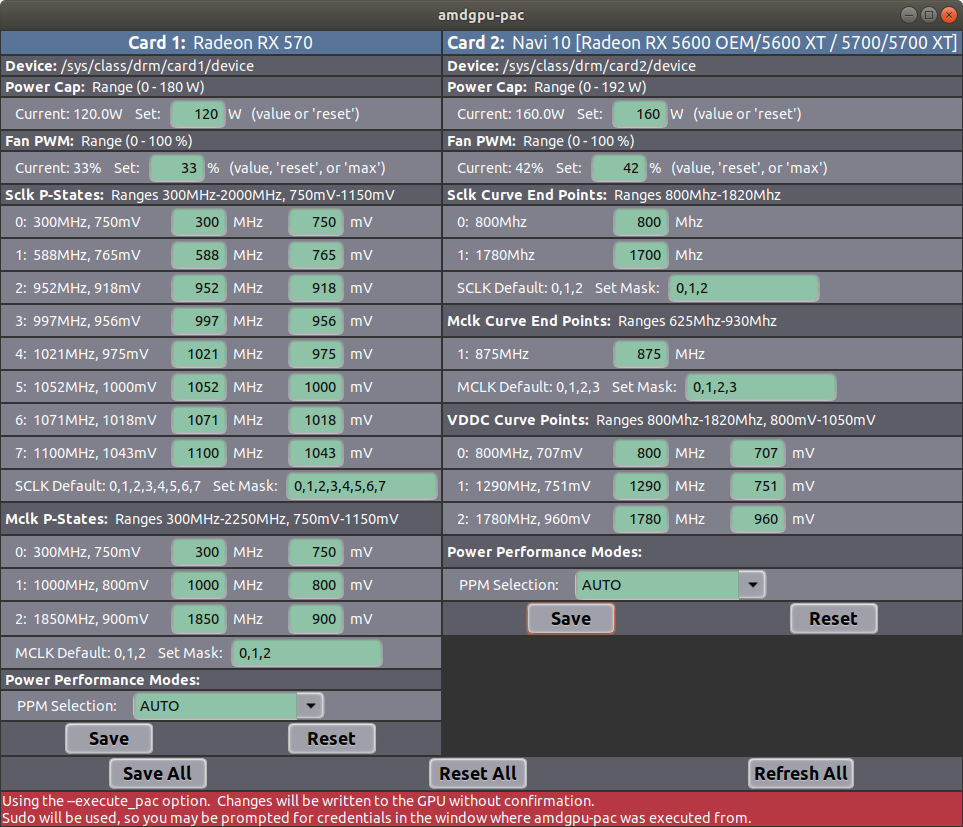

# amdgpu-utils - User Guide
A set of utilities for monitoring AMD GPU performance and modifying control settings.

## Current amdgpu-utils Version: 2.3.1
 - [Getting Started](#getting-started)
 - [Using amdgpu-ls](#using-amdgpu-ls)
 - [Using amdgpu-monitor](#using-amdgpu-monitor)
 - [Using amdgpu-pac](#using-amdgpu-pac)
 - [Using amdgpu-pciid](#using-amdgpu-pciid)
 - [Optimizing Compute Performance-Power](#optimizing-compute-performance-power)

## Getting Started
First, this set of utils is written and tested with Python3.6.  If you are using and older
version, you will likely see syntax errors.  Unfortuntately, I don't know how to catch a
syntax error, so if you have issues, just execute:
```
./amdgpu-chk
```
and it should display a message indicating any Python or Kernel incompatibilities.  You will
also notice that there is a minumum version of the Kernel that supports these features, but be
warned, I have only tested it with 4.15. There have been amdgpu features implemented over time
that spans many releases of the kernel, so your experience in using these utilities with older 
kernels may not be ideal.

In order to use any of these utilities, you must have the *amdgpu* open source driver
package installed. You can check with the following command:
```
dpkg -l amdgpu
```

You also must set your linux machine to boot with the feature mask set to support the functionality
that these tools depend on.  Do do this, you must set amdgpu.ppfeaturemask=0xffff7fff.  This
can be accomplished by adding amdgpu.ppfeaturemask=0xffff7fff to the GRUB_CMDLINE_LINUX_DEFAULT
value in /etc/default/grub and executing *sudo update-grub* as in the following example:
```
cd /etc/default
sudo vi grub
```
Modify to include the featuremask as follows:
```
GRUB_CMDLINE_LINUX_DEFAULT="quiet splash amdgpu.ppfeaturemask=0xffff7fff"
```
After saving, update grub:
```
sudo update-grub
```
and then reboot.


## Using amdgpu-ls
After getting your system setup to support amdgpu-utils, it is best to verify functionality by 
listing your GPU details with the *amdgpu-ls* command.  It first attempts for detect the version 
of amdgpu drivers you have installed and then check compatibility of installed AMD GPUs.  Its
default behavior is to list basic GPU details for all compatible cards:
```AMD Wattman features enabled: 0xffff7fff
amdgpu version: 18.50-725072
2 AMD GPUs detected, 2 may be compatible, checking...
2 are confirmed compatible.

UUID: 309abc9c97ea451396334b11199d0680
amdgpu-util Compatibility: Yes
Device ID: {'vendor': '0x1002', 'device': '0x687f', 'subsystem_vendor': '0x1002', 'subsystem_device': '0x0b36'}
GPU P-State Type: 1
Decoded Device ID: RX Vega64
Card Model:  Vega 10 XT [Radeon RX Vega 64] (rev c1)
Short Card Model:  RX Vega 64
Display Card Model: RX Vega64
Card Number: 1
Card Path: /sys/class/drm/card1/device/
PCIe ID: 44:00.0
Driver: amdgpu
vBIOS Version: 113-D0500100-105
HWmon: /sys/class/drm/card1/device/hwmon/hwmon6/
Current Power (W): 118.0
Power Cap (W): 140.0
Power Cap Range (W): [0, 220]
Fan Enable: 1
Fan PWM Mode: [1, 'Manual']
Current Fan PWM (%): 0
Current Fan Speed (rpm): 0
Fan Target Speed (rpm): 0
Fan Speed Range (rpm): [400, 4900]
Fan PWM Range (%): [0, 100]
Current Temp (C): 35.0
Critical Temp (C): 91.0
Current VddGFX (mV): 1037
Vddc Range: ['800mV', '1200mV']
Current Loading (%): 99
Link Speed: 8 GT/s
Link Width: 16
Current SCLK P-State: 6
Current SCLK: 1536Mhz 
SCLK Range: ['852MHz', '2400MHz']
Current MCLK P-State: 3
Current MCLK: 945Mhz 
MCLK Range: ['167MHz', '1500MHz']
Power Performance Mode: 4-COMPUTE
Power Force Performance Level: manual
```

If everything is working fine, you should see no warning or errors.  The listing utility
also has other command line options:
```usage: amdgpu-ls [-h] [--about] [--pstates] [--ppm] [--clinfo] [--no_fan] [-d]

optional arguments:
  -h, --help   show this help message and exit
  --about      README
  --pstates    Output pstate tables instead of GPU details
  --ppm        Output power/performance mode tables instead of GPU details
  --clinfo     Include openCL with card details
  --no_fan     don't include fan setting options
  -d, --debug  Debug output
```

The *--clinfo* option will make a call to clinfo, if it is installed, and list these parameters
along with the basic parameters.  The benifit of running this in *amdgpu-ls* is that the tool
uses the PCIe slot id to associate clinfo results with the appropriate GPU in the listing.

The *--pstates* and *--ppm* options will display the P-State definition table and the power
performance mode table.
```
./amdgpu-ls --pstate --ppm
AMD Wattman features enabled: 0xffff7fff
amdgpu version: 18.50-725072
2 AMD GPUs detected, 2 may be compatible, checking...
2 are confirmed compatible.

Card: /sys/class/drm/card1/device/
SCLK:                   MCLK:
0:  852Mhz    800mV     0:  167Mhz    800mV   
1:  991Mhz    900mV     1:  500Mhz    800mV   
2:  1084Mhz   950mV     2:  800Mhz    950mV   
3:  1138Mhz   1000mV    3:  945Mhz    1100mV  
4:  1200Mhz   1050mV  
5:  1401Mhz   1100mV  
6:  1536Mhz   1150mV  
7:  1630Mhz   1200mV  

Card: /sys/class/drm/card1/device/
Power Performance Mode: manual
  0:  3D_FULL_SCREEN                70                60                 1                 3
  1:    POWER_SAVING                90                60                 0                 0
  2:           VIDEO                70                60                 0                 0
  3:              VR                70                90                 0                 0
  4:         COMPUTE                30                60                 0                 6
  5:          CUSTOM                 0                 0                 0                 0
 -1:            AUTO              Auto
```

## Using amdgpu-monitor
By default, *amdgpu-monitor* will display a text based table in the current terminal window
that updates every sleep duration as defined by *--sleep N* or 2s by default.
```
┌─────────────┬────────────────┬────────────────┐
│Card #       │card1           │card0           │
├─────────────┼────────────────┼────────────────┤
│Model        │RX Vega64       │Vega 20 [Radeon │
│Load %       │99              │93              │
│Power (W)    │60.0            │138.0           │
│Power Cap (W)│140.0           │140.0           │
│Energy (kWh) │1e-06           │3e-06           │
│T (C)        │30.0            │47.0            │
│VddGFX (mV)  │1037            │1062            │
│Fan Spd (%)  │0               │93              │
│Sclk (MHz)   │1536Mhz         │                │
│Sclk Pstate  │6               │-1              │
│Mclk (MHz)   │945Mhz          │                │
│Mclk Pstate  │3               │-1              │
│Perf Mode    │4-COMPUTE       │4-COMPUTE       │
└─────────────┴────────────────┴────────────────┘
```
The fields are as the same as the gui version of the display available with the *--gui* option.

The first row gives the card number for each GPU.  This number is the integer used by the driver
for each GPU.  Most fields are self discribing.  The Power Cap field is especially useful in managing
compute power efficiency and lowering the cap can result in more level loading and overall lower power
usage for little compromise in performance.  The Energy field is a derived metrics that accumulate 
energy usage in kWh consumed since the monitor started.  It is calculated by the product of the latest
power reading and the elapsed time since the last power reading and accumulated. 

You will notice that there are no clock frequencies or valid p-states for the Vega20 card.  This is
due to a change in Frequency vs Voltage in this generation of GPUs.  The P-state table for Vega 20
is a definition of Frequency vs. Voltage curves.  I am not certain how to read current frequencies or 
modify curves, so these features are disabled in the utilities for Vega20 and other GPU's that use this
approach.

The Perf Mode field gives the current power performance mode, which can be modified in with amdgpu-pac.
These modes affect the how frequency and voltage are managed versus loading.  Also a very important 
parameter when managing compute performance.

## Using amdgpu-pac


## Using amdgpu-pciid

## Optimizing Compute Performance-Power
